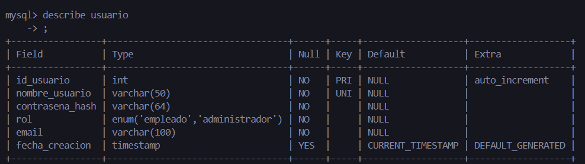
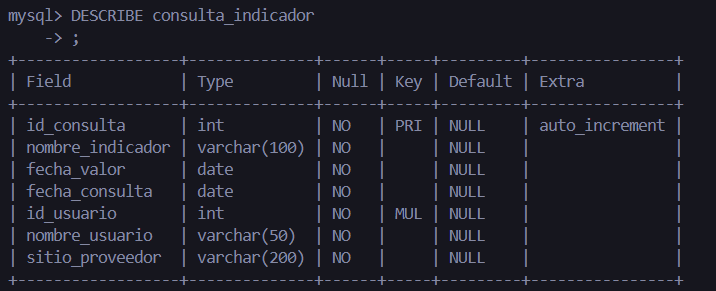
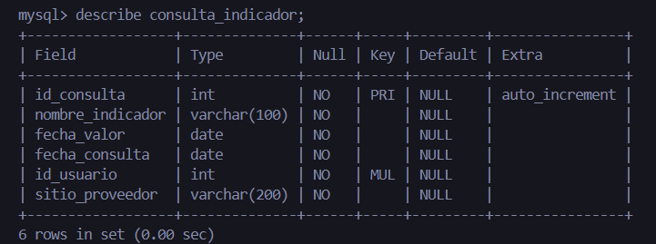

## 📂 Base de Datos: sistema_indicadores
## 🧱 Creación Inicial

### Se creó la base de datos y las tablas principales:

```sql
    CREATE TABLE IF NOT EXISTS usuario(
    id_usuario INT AUTO_INCREMENT PRIMARY KEY,
    nombre_usuario VARCHAR(50) UNIQUE NOT NULL,
    contraseña_hash VARCHAR(64) NOT NULL,
    rol ENUM('empleado', 'administrador') NOT NULL,
    email VARCHAR(100) NOT NULL,
    fecha_creacion TIMESTAMP DEFAULT CURRENT_TIMESTAMP
);
```

### OBSERVACION 

🧩 Hay Cambiar contraseña_hash por contrasena_hash

Ya que quieres reemplazar el nombre del campo (por evitar la ñ o simplemente normalizarlo):

### Esto se hace de esta manera

```sql 
ALTER TABLE usuario
CHANGE COLUMN contraseña_hash contrasena_hash VARCHAR(64) NOT NULL;
```
### Ahora se vera de esta manera la tabla usuario
```sql
DESCRIBE usuario;
```


## Se crea el consulta_indicador

```sql 
CREATE TABLE IF NOT EXISTS consulta_indicador(
    id_consulta INT AUTO_INCREMENT PRIMARY KEY,
    nombre_indicador VARCHAR(100) NOT NULL,
    fecha_valor DATE NOT NULL,
    fecha_consulta DATE NOT NULL,
    id_usuario INT NOT NULL,
    nombre_usuario VARCHAR(50) NOT NULL,
    sitio_proveedor VARCHAR(200) NOT NULL,
    FOREIGN KEY (id_usuario) REFERENCES usuario(id_usuario) ON DELETE CASCADE
);

```


### OBSERVACION 

🧹 Eliminar nombre_usuario redundante en consulta_indicador

```sql 
ALTER TABLE consulta_indicador
DROP COLUMN nombre_usuario;

```

### verificar los cambios
```sql
DESCRIBE consulta_indicador;
```

